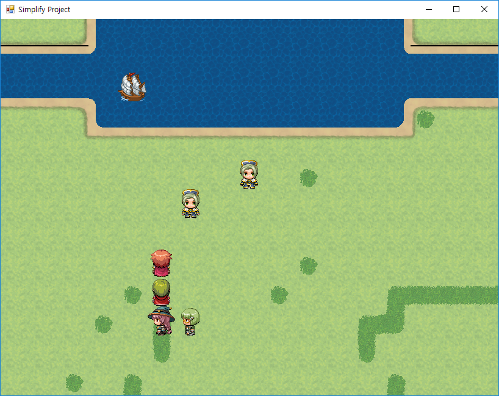

# CefMV
You can be embedded your RPG Maker MV game in .NET process. 



# Native API
These API can play the sound file for ogg vorbis using C# NAudio 1.8.4 library.

```javascript
RSAudio.loadMusic(fileName, id);
RSAudio.loadSound(fileName, id);
RSAudio.playMusic(id);
RSAudio.playSound(id);
RSAudio.stopMusic(id);
RSAudio.stopSound(id);
RSAudio.setMusicVolume(f);
RSAudio.dispose();
```

Easy to use.
```javascript
// This line loads the sound file called 'deepnight.ogg' from audio/bgm/ folder.
RSAudio.loadMusic("deepnight.ogg", "BGM");
// Plays the sound file that has the id called 'BGM'
RSAudio.playMusic("BGM");
// Controls the music volume as the value between 0.0 and 100.0.
RSAudio.setMusicVolume(50.0); 
```

These API can show dynamic message box for Windows, and provide other functions.

```javascript
RSTools.showMessageBox(title, content, yesCallback, noCallback);
RSTools.focus();
RSTools.setGameTitle(title);
RSTools.setScreenSize(width, height);
RSTools.updateWindowSettings();

// Changes the main game title.
RSTools.setGameTitle("My Game");
RSTools.updateWindowSettings();

// Shows the message box that contains two buttons called 'yes' or 'no'.
RSTools.showMessageBox("My Game", "Capture the screenshot?", function() {
    // yes callback
}, function() {
    // no callback
});

```